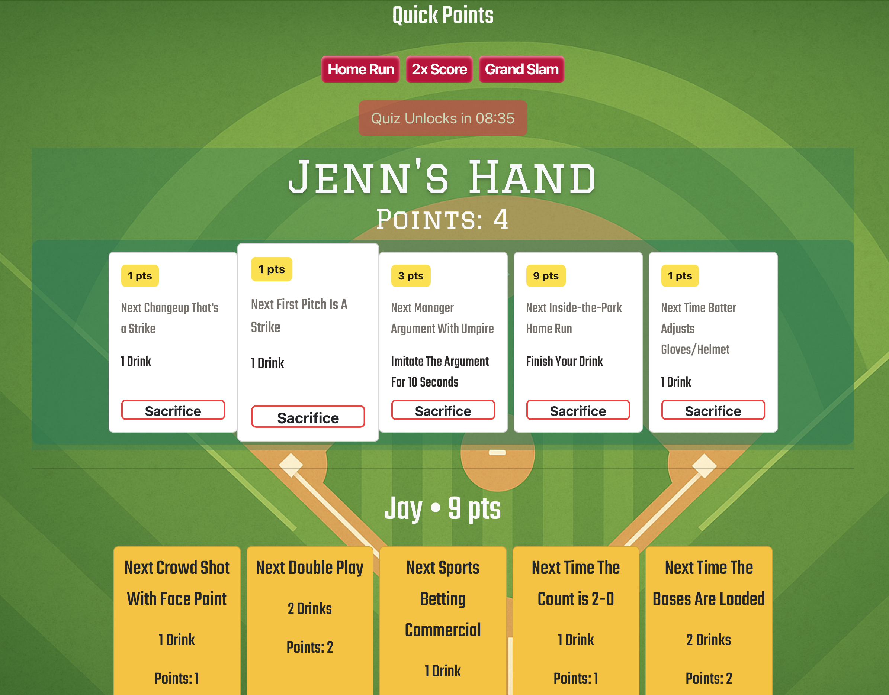
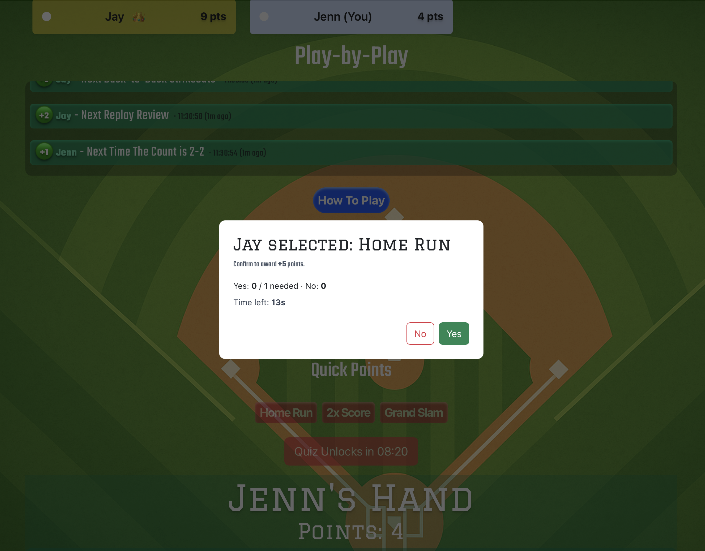
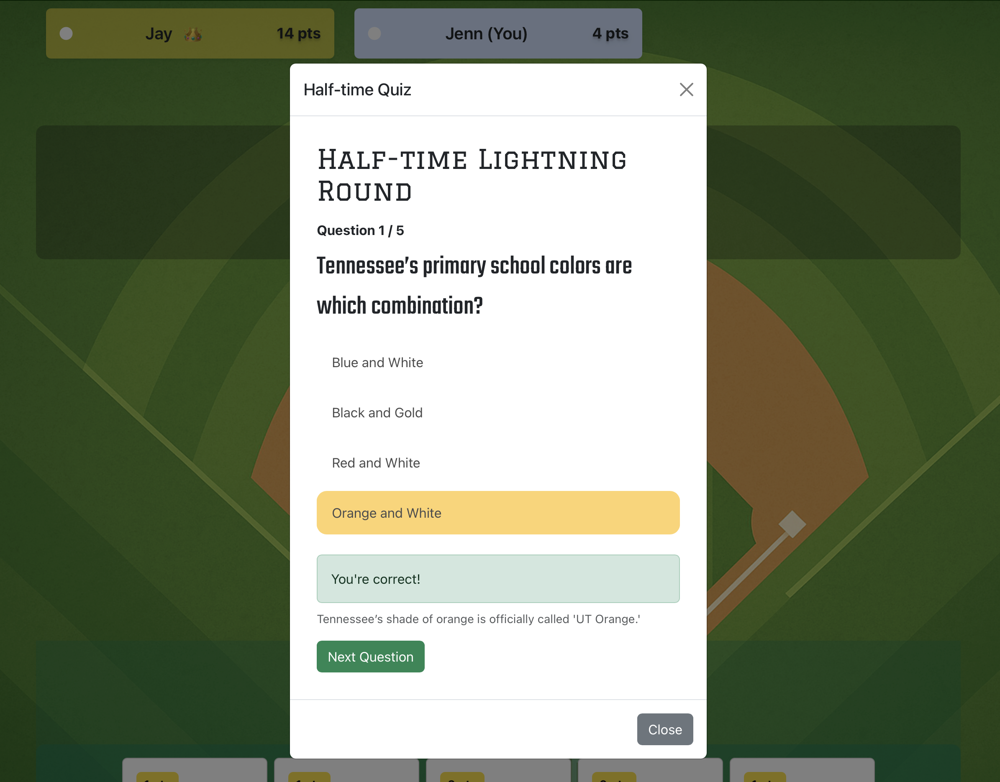

# Sports Shuffle

Real-time multiplayer sports game that lets users compete by predicting live game events, powered by synchronized game state and event-driven architecture.

[Live Demo](https://gamesapp-0bf773689b09.herokuapp.com)

## Key Features
 - Real-time multiplayer gameplay using Socket.IO
 - Dynamic game rooms with isolated state per session
 - Live event system with voting, scoring, and reactions
 - Interactive UI with quick reactions, quizzes, and scoring mechanics
 - Single-player and multiplayer modes
 - Persistent game flow with synchronized updates across all players

## Technical Highlights
 - Designed and implemented an event-driven architecture for real-time gameplay
 - Built a room-based state management system supporting concurrent games
 - Implemented server-side validation to prevent desync and ensure fairness
 - Optimized React rendering to handle rapid state updates without performance drops
 - Centralized socket event handling for scalability and maintainability

## Tech Stack
 - Frontend: React, Vite, Tailwind CSS
 - Backend: Node.js, Express
 - Real-time: Socket.IO

## Architecture
 - Client handles UI and user interactions
 - Server manages authoritative game state
 - Socket.IO syncs events between players in real time
 - Each room maintains isolated game logic and lifecycle

## Screenshots

### Home Page

### Game Selection

### Room Creation

### Game Lobby

### Scoreboard/Play-by-Play

### Game Screen

### Quick Points Voting

### Quiz

### Reactions
